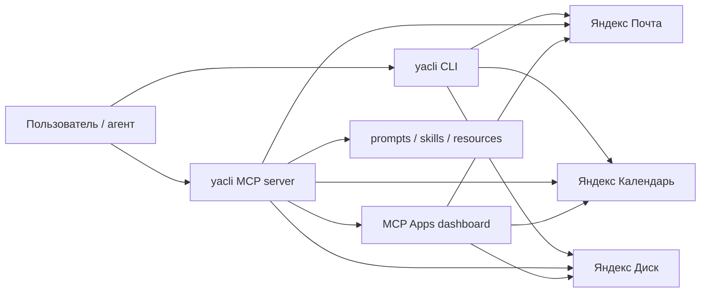

<h1 align="center">yacli</h1>

<p align="center"><strong>CLI, MCP server и MCP Apps для Яндекс Почты, Календаря и Диска</strong></p>

<p align="center">Один аккуратный продуктовый интерфейс для терминала, AI-агентов и MCP-хостов.</p>

<p align="center">
  <a href="https://github.com/NextStat/yacli/releases"></a>
  <a href="https://github.com/NextStat/yacli/actions/workflows/ci.yml"></a>
  
  
  
  <a href="https://github.com/NextStat/yacli/blob/main/LICENSE"></a>
</p>

<p align="center">
  <a href="#быстрый-старт"><strong>Быстрый старт</strong></a> •
  <a href="#почему-yacli"><strong>Почему yacli</strong></a> •
  <a href="#примеры-кросс-сервисных-skills-и-workflows"><strong>Сценарии</strong></a> •
  <a href="#mcp"><strong>MCP</strong></a> •
  <a href="#установка"><strong>Установка</strong></a>
</p>

<table>
  <tr>
    <td width="33%" valign="top">
      <strong>Для людей</strong><br/><br/>
      Повседневный CLI для почты, календаря, вложений, событий и приватного Диска.
    </td>
    <td width="33%" valign="top">
      <strong>Для агентов</strong><br/><br/>
      Полноценный MCP server c <code>stdio</code>, <code>http</code>, prompts, skills, resources, completions, roots и write-tools.
    </td>
    <td width="33%" valign="top">
      <strong>Для MCP-хостов с UI</strong><br/><br/>
      MCP Apps с dashboard, deep links, браузером ресурсов и кросс-сервисными сценариями.
    </td>
  </tr>
</table>

<table>
  <tr>
    <td width="33%" valign="top">
      <strong>Письмо → вложение → файл</strong><br/><br/>
      Найти письмо, выгрузить нужное вложение и сохранить его локально или передать дальше агенту.
    </td>
    <td width="33%" valign="top">
      <strong>Письмо → <code>.ics</code> → событие</strong><br/><br/>
      Разобрать приглашение из письма и сразу завести встречу в нужный календарь.
    </td>
    <td width="33%" valign="top">
      <strong>Файл → письмо</strong><br/><br/>
      Взять локальный файл, приложить его к письму и отправить без ручной рутины.
    </td>
  </tr>
</table>

> `yacli` нужен, когда хочется один внятный интерфейс для Яндекс Почты, Календаря и Диска: в терминале, в Claude / Codex / Gemini и внутри MCP Apps-хостов.

## Быстрый старт

<table>
  <tr>
    <td width="52%" valign="top">
      <strong>Запуск за минуту</strong>
      <pre lang="bash"><code>curl -fsSL https://raw.githubusercontent.com/NextStat/yacli/main/scripts/install.sh | sh
yacli add me@yandex.ru
yacli login
yacli login calendar --app-password &lt;пароль&gt;
yacli mcp install --client claude</code></pre>
    </td>
    <td width="48%" valign="top">
      <strong>Что получите сразу</strong><br/><br/>
      • локальный CLI для Почты, Календаря и Диска<br/>
      • MCP server для Claude, Codex, Gemini и других клиентов<br/>
      • prompts, embedded skills, resources и dashboard для MCP Apps<br/>
      • готовые кросс-сервисные сценарии без клея из скриптов
    </td>
  </tr>
</table>

### С чего начать

| Если вам нужно | Что делать |
| --- | --- |
| **Быстро подключить Почту и Диск** | `yacli add` → `yacli login` |
| **Подключить Календарь** | получить пароль приложения Яндекс ID → `yacli login calendar --app-password <пароль>` |
| **Поставить MCP в Claude / Codex / Gemini** | `yacli mcp install --client <client>` |
| **Поднять локальный HTTP MCP** | `yacli mcp --transport http --listen 127.0.0.1:8787` |

### Где это особенно хорошо работает

| Клиент | MCP | Apps / UI | Skills | Prompts |
| --- | --- | --- | --- | --- |
| `Claude Code` | `stdio` + `http` | Да | Да | Да |
| `Claude Desktop / Cowork` | Да | Да | Нет | Да |
| `Codex` | `stdio` + `http` | Да | Да | Да |
| `Gemini CLI` | `stdio` + `http` | Да | Да | Да |
| `Cursor / Windsurf / Warp / Zed` | Да | зависит от хоста | частично | Да |

### Готовые сценарии

| Сценарий | Команды / surface |
| --- | --- |
| **Письмо → вложение → локальный файл** | `mail read` → `mail attachment export` |
| **Письмо → `.ics` → событие** | `mail search` → `mail invite inspect` → `mail invite create-event` |
| **Локальный файл → письмо** | `mail send --attach` |
| **Агент → prompt → реальное действие** | MCP `prompts/get` → `tools/call` → `ui://yacli/dashboard` |

```bash
yacli mail attachment export 1353 --index 1 --output ./invoice.pdf
yacli mail invite create-event 1353 --name invite.ics --calendar team
yacli mail send person@example.com "Счёт" "Во вложении файл" --attach ./invoice.pdf
yacli mcp --transport http --listen 127.0.0.1:8787
```

## Почему yacli

| Surface | Что это даёт |
| --- | --- |
| `Один runtime` | Почта, календарь и диск живут в одном бинаре, одном конфиге и одном агентском контракте. |
| `Apps-first MCP` | `yacli` умеет не только tools, но и `MCP Apps`: dashboard, prompts, embedded skills, resources, live subscriptions. |
| `Кросс-сервисные workflows` | Можно пройти путь `письмо -> вложение -> .ics -> событие`, `файл -> письмо`, `агент -> MCP prompt -> реальное действие`. |
| `Ship-ready` | Готовые релизы для macOS, Linux `x86_64`/`arm64`, Windows `x86_64`, плюс `yacli update`. |



## Что умеет

- читать, искать, отправлять, пересылать и отвечать на письма;
- скачивать вложения, разбирать `.ics` / `text/calendar` и создавать события из email-приглашений;
- смотреть календари и события, создавать и удалять встречи;
- просматривать приватный Диск, создавать папки и загружать файлы;
- работать с несколькими учетными записями и быстро переключаться между ними;
- устанавливаться как MCP server и как workflow layer для агентских клиентов.

## Примеры кросс-сервисных skills и workflows

Эти сценарии уже реально есть в текущем surface `yacli` и работают либо как embedded `SKILL.md`, либо как MCP prompt / Apps workflow:

| Skill / workflow | Что связывает | Как выглядит запрос |
| --- | --- | --- |
| `yacli-daily-briefing` / `daily-briefing` | Почта + календарь | `Собери утреннюю сводку по письмам и встречам` |
| `yacli-reply-with-context` / `reply-with-context` | Почта + календарь | `Ответь на письмо с учётом моего расписания` |
| `yacli-attachment-to-disk` / `attachment-to-disk` | Почта + локальный диск | `Найди письмо и сохрани вложение в файл` |
| `yacli-send-file-by-mail` / `send-file-by-mail` | Локальный диск + почта | `Отправь файл с диска по почте` |
| `yacli-invite-to-calendar` / `invite-to-calendar` | Почта + календарь | `Найди письмо с приглашением и добавь встречу в календарь` |

CLI / MCP примеры для этих сценариев:

```bash
# daily briefing
yacli mail list --limit 10
yacli calendar events

# reply with context
yacli mail read 1353
yacli calendar events 2026-03-14 2026-03-16
yacli mail reply 1353 "Подтверждаю, это окно подходит"

# attachment to disk
yacli mail search "invoice"
yacli mail attachment export 1353 --name invoice.pdf --output ./invoice.pdf

# send file by mail
yacli mail send person@example.com "Счёт" "Во вложении файл" --attach ./invoice.pdf

# invite to calendar
yacli mail search "приглашение"
yacli mail invite inspect 1353 --index 1
yacli mail invite create-event 1353 --index 1 --calendar team
```

Для MCP-клиентов эти же сценарии доступны через:

- `prompts/get` для `daily-briefing`, `reply-with-context`, `attachment-to-disk`, `send-file-by-mail`, `invite-to-calendar`;
- `resource://yacli/skill/yacli-daily-briefing`
- `resource://yacli/skill/yacli-reply-with-context`
- `resource://yacli/skill/yacli-attachment-to-disk`
- `resource://yacli/skill/yacli-send-file-by-mail`
- `resource://yacli/skill/yacli-invite-to-calendar`

Важно:

- `yacli` не является продуктом Яндекса;
- Яндекс этот проект не поддерживает;
- это самостоятельный проект с открытым исходным кодом.

## Установка

### macOS и Linux

```bash
curl -fsSL https://raw.githubusercontent.com/NextStat/yacli/main/scripts/install.sh | sh
```

### Windows

```powershell
irm https://raw.githubusercontent.com/NextStat/yacli/main/scripts/install.ps1 | iex
```

### Готовые архивы

Готовые сборки лежат в [GitHub Releases](https://github.com/NextStat/yacli/releases).

Публикуемые архивы:

- macOS `x86_64` и `arm64`;
- Linux `x86_64` и `arm64`;
- Windows `x86_64`.

### Из исходников

Этот вариант нужен только тем, кто хочет собирать `yacli` самостоятельно:

```bash
cargo install --path .
```

### Обновление

Если `yacli` уже установлен из release-бинарника или в доступный для записи bin-dir, обновить его можно прямо из CLI:

```bash
yacli update
yacli update --check
```

Если нужен private release mirror или локальный test feed, можно переопределить base URL:

```bash
export YACLI_UPDATE_BASE_URL='https://mirror.example.test/releases/download/v0.4.1'
yacli update --check
```

## Начало работы

### 1. Добавьте адрес

```bash
yacli add me@yandex.ru
yacli whoami
```

Если псевдоним не указать, `yacli` создаст его сам.
Если нужен свой псевдоним:

```bash
yacli add me@yandex.ru personal
```

### 2. Подключите Почту и Диск

```bash
yacli login
```

Эта команда подключает сразу две службы:

- Почту;
- приватный Диск.

Если нужно подключить только одну:

```bash
yacli login mail
yacli login disk
```

### 3. Подключите Календарь

Для Календаря нужен пароль приложения Яндекс ID:

```bash
yacli login calendar --app-password <пароль>
```

Как получить этот пароль:

1. Откройте [Пароли приложений Яндекс ID](https://yandex.ru/support/id/ru/authorization/app-passwords).
2. Перейдите `Безопасность` -> `Доступ к вашим данным` -> `Пароли приложений`.
3. Выберите тип `Календарь`.
4. Создайте пароль, например `yacli calendar`, и сразу скопируйте его.

Если нужен подробный вариант с `env`-переменной и пояснениями по хранению секрета, см. раздел [Как получить пароль приложения для Календаря](#как-получить-пароль-приложения-для-календаря).

### 4. Проверьте, что все работает

```bash
yacli status
yacli mail list
yacli calendar calendars
yacli disk info
```

## Повседневные команды

### Почта

```bash
yacli mail folders
yacli mail list
yacli mail search "смета"
yacli mail read 1353
yacli mail reply 1353 "Принято, спасибо"
yacli mail forward 1353 person@example.com "Посмотрите, пожалуйста"
yacli mail attachment export 1353 --index 1 --output ./invoice.pdf
yacli mail invite inspect 1353 --index 1
yacli mail invite create-event 1353 --index 1
yacli mail send person@example.com "Синк" "Привет"
yacli mail send person@example.com "Счёт" "Во вложении файл" --attach ./invoice.pdf
```

Что важно:

- `list`, `search`, `read`, `reply` и `forward` по умолчанию работают с папкой `INBOX`;
- число вроде `1353` — это идентификатор письма из вывода `mail list` или `mail search`;
- `mail attachment export` сохраняет конкретное вложение по `--index` или точному `--name`;
- `mail invite inspect` разбирает `.ics` или `text/calendar` вложение и показывает поля VEVENT;
- `mail invite create-event` создаёт событие CalDAV из выбранного VEVENT внутри `.ics` или `text/calendar` вложения;
- `mail send --attach` добавляет один или несколько локальных файлов во вложение письма;
- если нужна другая папка, добавьте `--folder "Имя папки"`;
- если нужен HTML, копии или скрытые копии, используйте `--html`, `--cc` и `--bcc`.

Примеры:

```bash
yacli mail list --folder "Отправленные" --limit 20
yacli mail search "договор" --folder "Архив 2026"
yacli mail attachment export 1353 --name invoice.pdf --output ./invoice.pdf
yacli mail invite inspect 1353 --name invite.ics
yacli mail invite create-event 1353 --name invite.ics --calendar team --event-index 2
yacli mail send person@example.com "Счет" "Отправляю счет" --cc boss@example.com
yacli mail send person@example.com "Счет" "Отправляю счет" --attach ./invoice.pdf --attach ./spec.docx
```

### Календарь

```bash
yacli calendar calendars

yacli calendar events
yacli calendar events 2026-03-13 2026-03-20 --limit 20

yacli calendar create "Синк команды" 2026-03-13T09:00:00Z 2026-03-13T10:00:00Z

yacli calendar delete <id>
```

Что важно:

- `calendar events` без дат показывает ближайшие 30 дней;
- `calendar create` и `calendar delete` по умолчанию работают с календарем `default`;
- если нужен другой календарь, добавьте `--calendar <id>`.

### Диск

```bash
yacli disk info
yacli disk list
yacli disk list disk:/docs --limit 50
yacli disk mkdir disk:/docs/archive
yacli disk upload ./report.pdf disk:/docs/archive/report.pdf
```

Что важно:

- `disk list` без пути показывает корень `disk:/`;
- `disk mkdir` принимает только путь папки;
- `disk upload` принимает два позиционных аргумента: локальный файл и путь на Диске.

### Публичный Диск

```bash
yacli disk public show \
  --public-key https://disk.yandex.ru/i/WhGpLnQWR9efCA

yacli disk public download \
  --public-key https://disk.yandex.ru/i/WhGpLnQWR9efCA \
  --output ./sample.pdf
```

## Несколько адресов

```bash
yacli add personal@yandex.ru
yacli login

yacli add work@company.ru work
yacli use work
yacli login

yacli use personal
yacli mail list

yacli use work
yacli mail search "счет"
```

Что важно:

- у каждого адреса свои токены и свои настройки;
- команда `use` переключает текущую учетную запись;
- при необходимости можно явно указать `--account <псевдоним>`.

## Как получить пароль приложения для Календаря

1. Откройте [страницу паролей приложений Яндекс ID](https://yandex.ru/support/id/ru/authorization/app-passwords).
2. Перейдите в раздел `Безопасность` → `Доступ к вашим данным` → `Пароли приложений`.
3. Выберите тип `Календарь`.
4. Задайте имя, например `yacli calendar`.
5. Скопируйте пароль сразу после создания.

Подключение:

```bash
yacli login calendar --app-password <пароль>
```

Если не хотите хранить пароль локально:

```bash
export YACLI_CALENDAR_APP_PASSWORD='<пароль>'
yacli login calendar --env-var YACLI_CALENDAR_APP_PASSWORD
```

По умолчанию `yacli` больше не держит `store:*` секреты в plaintext TOML: OAuth-токены и пароли приложений сохраняются в системном keyring/keychain. Если у вас остался legacy `credentials.toml`, он будет автоматически мигрирован при первом обращении к secure backend.

Для headless или тестовых окружений можно явно включить legacy plaintext backend:

```bash
export YACLI_SECRET_BACKEND=file
```

## Для автоматизации

По умолчанию `yacli` печатает JSON. Если нужен табличный вывод:

```bash
yacli --format table mail list
```

Скрытая команда `guide` предназначена для автоматизации и агентских обвязок:

```bash
yacli guide
yacli guide --topic mail
```

## MCP

### Быстрый MCP старт

`yacli` можно запускать как MCP сервер по `stdio`:

```bash
yacli mcp
```

`stdio` transport автоматически совместим и с legacy `Content-Length` framing, и с line-delimited JSON, который используют актуальные версии Claude Code. Сервер отвечает в том же формате, в котором пришёл входящий MCP request, поэтому один и тот же `yacli mcp` можно безопасно регистрировать и в старых, и в новых stdio-клиентах.

Если нужен локальный HTTP transport для Apps-capable клиентов:

```bash
yacli mcp --transport http --listen 127.0.0.1:8787
```

Если сервер публикуется за прокси или через внешний URL, укажите канонический адрес:

```bash
yacli mcp --transport http --listen 127.0.0.1:8787 --public-url https://mcp.example.test/mcp
```

### Транспорты

| Transport | Когда использовать | Что важно |
| --- | --- | --- |
| `stdio` | Claude Code, локальные CLI MCP-клиенты | Автосогласование `Content-Length` и JSONL |
| `http` | Apps-capable клиенты и локальный networked MCP | Streamable HTTP + SSE notifications |

HTTP transport у `yacli` streamable:

- `POST /mcp` обрабатывает JSON-RPC requests и batch payloads;
- `GET /mcp` с `Accept: text/event-stream` и `Mcp-Session-Id` открывает SSE stream для server-initiated notifications;
- `DELETE /mcp` завершает HTTP MCP session.

Если нужно защитить HTTP transport bearer-токеном:

```bash
export YACLI_MCP_HTTP_BEARER_TOKEN='secret-token'
yacli mcp --transport http --listen 127.0.0.1:8787
```

Если нужен полноценный auth discovery surface с Protected Resource Metadata и `resource_metadata` в challenge, добавьте issuer:

```bash
export YACLI_MCP_HTTP_AUTH_ISSUER='https://auth.example.test'
```

### Установка в клиенты

Чтобы автоматически зарегистрировать сервер в локально доступных MCP-клиентах:

```bash
yacli mcp install
```

Эта команда не только регистрирует MCP сервер, но и раскладывает встроенные agent skills в клиентские каталоги там, где клиент это поддерживает. Сейчас в бинарь встроены:

- `yacli-shared`
- `yacli-mail`
- `yacli-calendar`
- `yacli-disk`
- `yacli-daily-briefing`
- `yacli-find-and-read`
- `yacli-reply-with-context`
- `yacli-attachment-to-disk`
- `yacli-send-file-by-mail`
- `yacli-invite-to-calendar`

Поддерживаемые клиенты:

- Claude Code
- Claude Desktop / Cowork
- Codex
- Gemini CLI
- Cursor
- Zed
- Windsurf
- Antigravity
- Warp

### Что получает MCP-клиент

| Слой | Что есть в `yacli` |
| --- | --- |
| `tools` | mail, calendar, disk, account, auth, update, roots |
| `resources` | account/auth resources, skills catalog, templated resources |
| `prompts` | `shared`, `mail`, `calendar`, `disk`, `daily-briefing`, `find-and-read`, `reply-with-context`, `attachment-to-disk`, `send-file-by-mail`, `invite-to-calendar` |
| `apps` | `ui://yacli/dashboard` с dashboard, browser, tool runner и update check |
| `completions` | accounts, folders, calendars, skills, dashboard args |

Если нужен только один клиент:

```bash
yacli mcp install --client codex
yacli mcp install --client cursor
```

Если нужен native HTTP registration в клиентах, которые его документируют:

```bash
yacli mcp install --client claude --transport http --url http://127.0.0.1:8787/mcp
yacli mcp install --client codex --transport http --url http://127.0.0.1:8787/mcp
yacli mcp install --client gemini --transport http --url http://127.0.0.1:8787/mcp
```

### Resource templates и guided workflows

Кроме обычных `tools/*` и `resources/read`, сервер также поддерживает resource templates:

```bash
# список шаблонов ресурсов
resources/templates/list

# примеры URI, которые можно читать через resources/read
resource://yacli/account/personal
resource://yacli/auth/personal
ui://yacli/dashboard?account=personal
ui://yacli/dashboard?account=personal&section=auth&resource=auth&tool=yacli.auth.status
```

И `resources/subscribe` / `resources/unsubscribe` для account/auth resources. В `stdio` и streamable `HTTP` это даёт live notifications через `notifications/resources/updated`.

Для guided workflows сервер теперь также отдает встроенные MCP prompts:

- `shared`
- `mail`
- `calendar`
- `disk`
- `daily-briefing`
- `find-and-read`
- `reply-with-context`
- `attachment-to-disk`
- `send-file-by-mail`
- `invite-to-calendar`

Это MCP-native эквиваленты встроенных `SKILL.md` recipe flows. В клиентах вроде Claude Desktop / Cowork, где отдельный `SKILL.md` surface отсутствует, именно `prompts/list` и `prompts/get` дают переносимый workflow layer поверх тех же `yacli` tools/resources/apps.

Важно: prompt titles, descriptions и сами prompt messages теперь русскоязычные, чтобы Claude Desktop / Cowork и другие MCP-клиенты могли лучше матчить естественные русские запросы вроде «сводка по письмам», «найди письмо» или «ответь с учётом расписания».

Для новых кросс-сервисных сценариев сервер теперь также отдаёт first-class workflows:

- `attachment-to-disk`: поиск письма и сохранение вложения через `yacli.mail.attachment.export`;
- `send-file-by-mail`: отправка локального файла через `yacli.mail.send` с `attachments`;
- `invite-to-calendar`: поиск письма, разбор `.ics`/`text/calendar` вложения и импорт нужного VEVENT в календарь через `yacli.mail.invite.create_event`.

Кроме того, встроенные skills теперь доступны и как MCP resources:

- `resource://yacli/skills` — каталог embedded skills
- `resource://yacli/skill/{skill}` — полный canonical `SKILL.md` конкретного workflow

Каждый prompt теперь указывает на соответствующий `resource://yacli/skill/...`, так что Claude Desktop / Cowork и другие MCP-клиенты могут читать тот же source of truth, что и Claude Code skills.

Сервер также поддерживает `completion/complete` для prompts и resource refs. Это даёт клиентам argument suggestions для:

- account aliases из локального `yacli` config
- embedded skill names для `resource://yacli/skill/{skill}`
- mail folders
- calendar windows и `default` calendar
- disk path starters
- dashboard resource arguments (`account`, `section`, `resource`, `tool`)

Для клиентов, которые объявляют MCP `roots` capability, `yacli` теперь также поднимает tool `yacli.roots.list`. Он делает реальный server-to-client `roots/list` request и возвращает текущие filesystem roots клиента в model/app surface.

### Write-capable MCP surface

По состоянию текущего stable surface MCP mail-tools уже поддерживают не только чтение, но и write actions:

- `yacli.mail.send`
- `yacli.mail.reply`
- `yacli.mail.forward`
- `yacli.mail.attachment.export`
- `yacli.mail.invite.inspect`
- `yacli.mail.invite.create_event`

`yacli.mail.send` теперь также принимает `attachments` как список локальных путей на хосте MCP-сервера.
`yacli.mail.invite.create_event` принимает тот же селектор вложения (`index` или `name`) и `event_index`, если в одном `.ics` лежит несколько VEVENT.

И MCP calendar-tools теперь тоже поддерживают write actions:

- `yacli.calendar.create`
- `yacli.calendar.delete`

И MCP disk-tools теперь тоже поддерживают базовые write actions:

- `yacli.disk.mkdir`
- `yacli.disk.upload`

### Поведение по клиентам и хостам

Важно:

- `Claude Code`, `Codex` и `Gemini CLI` умеют native HTTP registration, поэтому `yacli` поддерживает и `stdio`, и `http` install flow;
- `Claude Desktop / Cowork` использует отдельный config `claude_desktop_config.json`, поэтому `yacli mcp install --client claude` теперь регистрирует сервер и в Claude Code, и в Claude Desktop surface;
- для `Cursor`, `Zed`, `Windsurf`, `Warp` и `Antigravity` current stable install path в `yacli` остаётся `stdio`-ориентированным;
- skills автоматически устанавливаются для `Claude Code`, `Codex`, `Gemini CLI`, `Cursor`, `Windsurf`, `Warp` и `Antigravity`; для `Zed` MCP registration поддерживается, но отдельного skills surface сейчас нет;
- Claude Desktop / Cowork MCP registration поддерживается, но `SKILL.md` surface туда не устанавливается;
- Claude Desktop / Cowork при этом всё равно получает встроенные yacli workflows через стандартные MCP prompts;
- сервер может работать и как `stdio`, и как локальный HTTP transport на `/mcp`;
- `stdio` transport автоматически согласует framing между `Content-Length` и JSONL, поэтому Claude Code подключается без отдельного compatibility mode;
- если клиент объявляет `roots` capability, `tools/list` дополнительно рекламирует `yacli.roots.list`, а `notifications/roots/list_changed` инвалидирует кеш roots и заставляет сервер заново запросить `roots/list`;
- в `HTTP` это работает через `POST /mcp` с `Accept: text/event-stream`: сервер отвечает SSE stream, внутри которого сначала отправляет nested `roots/list`, а затем финальный JSON-RPC result для исходного `tools/call`;
- HTTP transport поддерживает session-scoped SSE stream для server-push notifications;
- если задан `YACLI_MCP_HTTP_BEARER_TOKEN`, защищённые HTTP tool calls требуют `Authorization: Bearer <token>`;
- `YACLI_MCP_HTTP_AUTH_ISSUER` опционален и нужен только если вы хотите включить Protected Resource Metadata и `resource_metadata` в `WWW-Authenticate` challenge;
- `yacli mcp install` не копирует секреты в клиентские конфиги;
- MCP Apps поддерживается с первого релиза через ресурс `ui://yacli/dashboard`, deep-link template `ui://yacli/dashboard{?account,section,resource,tool,skill,prompt}`, app-only tool `yacli.app.snapshot`, read-only tool `yacli.update.check` и встроенный resource inspector для templated resources;
- dashboard теперь сам поддерживает round-trip deep links: по мере смены account/resource/tool/skill он пересобирает канонический `ui://yacli/dashboard?...` current view URI и может шарить его обратно в host;
- dashboard resource inspector теперь умеет читать не только account/auth resources, но и embedded skills catalog plus individual `resource://yacli/skill/{skill}` resources;
- dashboard теперь также поднимает unified searchable browser поверх `tools/list`, `prompts/list`, `resources/list`, `resources/templates/list` и `resource://yacli/skills`, так что Apps-capable клиенты получают один searchable catalog по tools/prompts/resources/templates/skills;
- dashboard tools panel теперь также умеет работать как universal MCP tool runner: можно выбрать любой tool из текущего `tools/list`, увидеть его `inputSchema`, отредактировать JSON args и вызвать его прямо из hosted app, не оставаясь на нескольких hardcoded кнопках;
- dashboard теперь также строит capability-aware host profile: он показывает, что конкретный MCP Apps host реально умеет (`open-link`, `message`, `update-model-context`, `server resources`, `subscriptions`, `display modes`) и рекомендует лучший workflow для rich/hybrid/text-first host surface;
- dashboard также сохраняет последнее локальное view state в браузерном storage и восстанавливает его при следующем открытии, если новый URI не переопределяет эти поля явно;
- dashboard также показывает auth escalation surface: auth discovery, resource metadata и host actions для recovery у protected tools;
- dashboard также умеет безопасно проверять наличие нового release из Apps runtime через `Check updates`, не пытаясь self-replace живой MCP server process;
- prompts `mail`, `reply-with-context`, `calendar` и `disk` теперь могут вести клиента и через реальные MCP write-tools, а не только через read-only анализ;
- prompts дополнены MCP completions, так что Apps-capable и text MCP clients могут подсказывать аргументы без hardcoded client-side логики;
- обычные текстовые MCP-клиенты продолжают работать без UI.

<details>
<summary><strong>Развернуть полный список MCP возможностей</strong></summary>

- `Claude Code`, `Codex` и `Gemini CLI` умеют native HTTP registration, поэтому `yacli` поддерживает и `stdio`, и `http` install flow;
- `Claude Desktop / Cowork` использует отдельный config `claude_desktop_config.json`, поэтому `yacli mcp install --client claude` теперь регистрирует сервер и в Claude Code, и в Claude Desktop surface;
- для `Cursor`, `Zed`, `Windsurf`, `Warp` и `Antigravity` current stable install path в `yacli` остаётся `stdio`-ориентированным;
- skills автоматически устанавливаются для `Claude Code`, `Codex`, `Gemini CLI`, `Cursor`, `Windsurf`, `Warp` и `Antigravity`; для `Zed` MCP registration поддерживается, но отдельного skills surface сейчас нет;
- Claude Desktop / Cowork MCP registration поддерживается, но `SKILL.md` surface туда не устанавливается;
- Claude Desktop / Cowork при этом всё равно получает встроенные yacli workflows через стандартные MCP prompts;
- сервер может работать и как `stdio`, и как локальный HTTP transport на `/mcp`;
- `stdio` transport автоматически согласует framing между `Content-Length` и JSONL, поэтому Claude Code подключается без отдельного compatibility mode;
- если клиент объявляет `roots` capability, `tools/list` дополнительно рекламирует `yacli.roots.list`, а `notifications/roots/list_changed` инвалидирует кеш roots и заставляет сервер заново запросить `roots/list`;
- в `HTTP` это работает через `POST /mcp` с `Accept: text/event-stream`: сервер отвечает SSE stream, внутри которого сначала отправляет nested `roots/list`, а затем финальный JSON-RPC result для исходного `tools/call`;
- HTTP transport поддерживает session-scoped SSE stream для server-push notifications;
- если задан `YACLI_MCP_HTTP_BEARER_TOKEN`, защищённые HTTP tool calls требуют `Authorization: Bearer <token>`;
- `YACLI_MCP_HTTP_AUTH_ISSUER` опционален и нужен только если вы хотите включить Protected Resource Metadata и `resource_metadata` в `WWW-Authenticate` challenge;
- `yacli mcp install` не копирует секреты в клиентские конфиги;
- MCP Apps поддерживается с первого релиза через ресурс `ui://yacli/dashboard`, deep-link template `ui://yacli/dashboard{?account,section,resource,tool,skill,prompt}`, app-only tool `yacli.app.snapshot`, read-only tool `yacli.update.check` и встроенный resource inspector для templated resources;
- dashboard теперь сам поддерживает round-trip deep links: по мере смены account/resource/tool/skill он пересобирает канонический `ui://yacli/dashboard?...` current view URI и может шарить его обратно в host;
- dashboard resource inspector теперь умеет читать не только account/auth resources, но и embedded skills catalog plus individual `resource://yacli/skill/{skill}` resources;
- dashboard теперь также поднимает unified searchable browser поверх `tools/list`, `prompts/list`, `resources/list`, `resources/templates/list` и `resource://yacli/skills`, так что Apps-capable клиенты получают один searchable catalog по tools/prompts/resources/templates/skills;
- dashboard tools panel теперь также умеет работать как universal MCP tool runner: можно выбрать любой tool из текущего `tools/list`, увидеть его `inputSchema`, отредактировать JSON args и вызвать его прямо из hosted app, не оставаясь на нескольких hardcoded кнопках;
- dashboard теперь также строит capability-aware host profile: он показывает, что конкретный MCP Apps host реально умеет (`open-link`, `message`, `update-model-context`, `server resources`, `subscriptions`, `display modes`) и рекомендует лучший workflow для rich/hybrid/text-first host surface;
- dashboard также сохраняет последнее локальное view state в браузерном storage и восстанавливает его при следующем открытии, если новый URI не переопределяет эти поля явно;
- dashboard также показывает auth escalation surface: auth discovery, resource metadata и host actions для recovery у protected tools;
- dashboard также умеет безопасно проверять наличие нового release из Apps runtime через `Check updates`, не пытаясь self-replace живой MCP server process;
- prompts `mail`, `reply-with-context`, `calendar` и `disk` теперь могут вести клиента и через реальные MCP write-tools, а не только через read-only анализ;
- prompts дополнены MCP completions, так что Apps-capable и text MCP clients могут подсказывать аргументы без hardcoded client-side логики;
- обычные текстовые MCP-клиенты продолжают работать без UI.

</details>

## Где лежат настройки

- macOS: `~/Library/Application Support/yacli`
- Linux: `~/.config/yacli`
- Windows: `%APPDATA%\\yacli`

Чтобы использовать другой каталог:

```bash
export YACLI_CONFIG_DIR=/path/to/config-dir
```

## Что еще полезно знать

- `status` показывает, какие службы подключены у текущей учетной записи;
- если OAuth-токен Почты или Диска истек, достаточно снова выполнить `yacli login`;
- `mail forward` пересылает письмо вместе с обычными вложениями и inline-файлами;
- `disk public download` не перезаписывает существующий файл без `--force`.

## Проверка качества

```bash
cargo build --workspace
cargo test --workspace
cargo clippy --workspace --all-targets -- -D warnings
```
