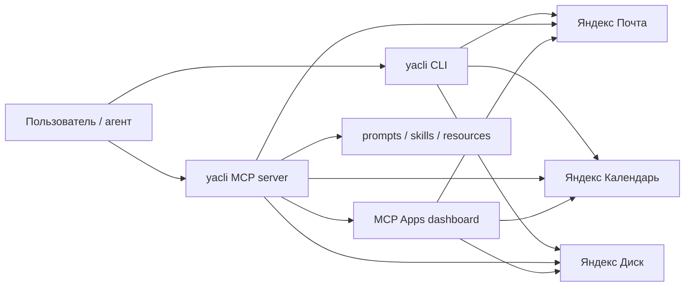

<p align="center">
  
</p>

<h1 align="center">yacli</h1>

<p align="center"><strong>CLI, MCP server и MCP Apps для Яндекс Почты, Календаря и Диска</strong></p>

<p align="center">Один аккуратный продуктовый интерфейс для терминала, ИИ-агентов и MCP-хостов.</p>

<p align="center">
  <a href="https://github.com/NextStat/yacli/releases"></a>
  <a href="https://github.com/NextStat/yacli/actions/workflows/ci.yml"></a>
  
  
  
  <a href="https://github.com/NextStat/yacli/blob/main/LICENSE"></a>
</p>

<p align="center">
  <a href="#установка"><strong>Установка</strong></a> •
  <a href="#быстрый-старт"><strong>Быстрый старт</strong></a> •
  <a href="#повседневные-команды"><strong>Команды</strong></a> •
  <a href="#кросс-сервисные-сценарии"><strong>Сценарии</strong></a> •
  <a href="#mcp"><strong>MCP</strong></a>
</p>

`yacli` связывает Яндекс Почту, Календарь и Диск в один внятный интерфейс: в терминале, в агентских клиентах и внутри MCP Apps. Один бинарь закрывает повседневную ручную работу, агентские интеграции и составные сценарии вроде `письмо → .ics → событие` или `файл → письмо`.

<table>
  <tr>
    <td width="33%" valign="top">
      <strong>CLI для ежедневной работы</strong><br/><br/>
      Почта, календарь, вложения, события и приватный Диск в одном бинаре и одном конфиге.
    </td>
    <td width="33%" valign="top">
      <strong>MCP для агентов</strong><br/><br/>
      Полноценный MCP-сервер с <code>stdio</code>, <code>http</code>, prompts, skills, resources, completions, roots и write-tools.
    </td>
    <td width="33%" valign="top">
      <strong>MCP Apps для UI-хостов</strong><br/><br/>
      Дашборд, deep links, prompts, браузер ресурсов и живые кросс-сервисные сценарии.
    </td>
  </tr>
</table>

<table>
  <tr>
    <td width="33%" valign="top">
      <strong>Письмо → вложение → файл</strong><br/><br/>
      Найти письмо, выгрузить нужное вложение и сохранить его локально без промежуточных скриптов.
    </td>
    <td width="33%" valign="top">
      <strong>Письмо → <code>.ics</code> → событие</strong><br/><br/>
      Разобрать приглашение из письма и сразу создать встречу в нужном календаре.
    </td>
    <td width="33%" valign="top">
      <strong>Файл → письмо</strong><br/><br/>
      Взять локальный файл, приложить его к письму и отправить через тот же интерфейс.
    </td>
  </tr>
</table>

<!--
TODO: добавить GIF / скриншот терминала с yacli mail list + yacli status
-->

## Установка

### macOS и Linux

```bash
curl -fsSL https://raw.githubusercontent.com/NextStat/yacli/main/scripts/install.sh | sh
```

### Windows

```powershell
irm https://raw.githubusercontent.com/NextStat/yacli/main/scripts/install.ps1 | iex
```

Готовые сборки для macOS `x86_64`/`arm64`, Linux `x86_64`/`arm64` и Windows `x86_64` лежат в [GitHub Releases](https://github.com/NextStat/yacli/releases).

<details>
<summary>Из исходников / обновление / private mirror</summary>

```bash
cargo install --path .                 # сборка из исходников
yacli update                           # обновить до последнего релиза
yacli update --check                   # проверить без установки
```

Для private release mirror:

```bash
export YACLI_UPDATE_BASE_URL='https://mirror.example.test/releases/download/v0.4.1'
yacli update --check
```

</details>

## Быстрый старт

**Запуск за минуту**

```bash
curl -fsSL https://raw.githubusercontent.com/NextStat/yacli/main/scripts/install.sh | sh
yacli add me@yandex.ru
yacli login
yacli login calendar --app-password <пароль>
yacli mcp install --client claude
```

После этого у вас сразу будут:

- локальный CLI для Почты, Календаря и Диска;
- MCP server для Claude, Codex, Gemini и других клиентов;
- prompts, embedded skills, resources и dashboard для MCP Apps;
- готовые кросс-сервисные сценарии без клея из скриптов.

### С чего начать

| Если вам нужно | Что делать |
| --- | --- |
| **Быстро подключить Почту и Диск** | `yacli add` → `yacli login` |
| **Подключить Календарь** | получить пароль приложения Яндекс ID → `yacli login calendar --app-password <пароль>` |
| **Поставить MCP в Claude / Codex / Gemini** | `yacli mcp install --client <client>` |
| **Поднять локальный HTTP MCP** | `yacli mcp --transport http --listen 127.0.0.1:8787` |

<details>
<summary><strong>Как получить пароль приложения для Календаря</strong></summary>

1. Откройте [Пароли приложений Яндекс ID](https://yandex.ru/support/id/ru/authorization/app-passwords).
2. Перейдите `Безопасность` → `Доступ к вашим данным` → `Пароли приложений`.
3. Выберите тип `Календарь`.
4. Задайте имя, например `yacli calendar`, и скопируйте пароль.

Если не хотите хранить пароль локально:

```bash
export YACLI_CALENDAR_APP_PASSWORD='<пароль>'
yacli login calendar --env-var YACLI_CALENDAR_APP_PASSWORD
```

OAuth-токены и пароли приложений хранятся в системном keyring/keychain. Для headless окружений: `export YACLI_SECRET_BACKEND=file`.

</details>

### Проверьте, что всё работает

```bash
yacli status
yacli mail list
yacli calendar calendars
yacli disk info
```

## Живой сценарий в Claude Cowork

`yacli` уже тянет реальные составные задачи внутри агентского интерфейса, а не только отдельные команды.

**Запрос в Claude Cowork:**

> Создай событие "Ревью yacli v0.5" понедельник в 11:00 на 30 минут, отправь напоминание на почту, и создай папку на Диске для материалов

**Что получилось:**

1. Событие создано в календаре на понедельник, **16 марта 2026**, `11:00–11:30`.
2. Напоминание на почту отправлено.
3. Папка на Яндекс Диске подтверждена: `/yacli-v0.5-review`.

**Почему это важно:** один запрос связывает сразу три surface `yacli`:

- календарь для создания события;
- почту для отправки напоминания;
- диск для подготовки рабочей папки.

Именно это и является продуктовой целью `yacli`: не просто “дать tools”, а довести реальные рабочие сценарии до одного понятного контракта для людей и агентов.

## Повседневные команды

### Почта

```bash
yacli mail folders
yacli mail list
yacli mail search "смета"
yacli mail read 1353
yacli mail reply 1353 "Принято, спасибо"
yacli mail forward 1353 person@example.com "Посмотрите, пожалуйста"
yacli mail send person@example.com "Синк" "Привет"
yacli mail send person@example.com "Счёт" "Во вложении файл" --attach ./invoice.pdf
```

Вложения и приглашения:

```bash
yacli mail attachment export 1353 --index 1 --output ./invoice.pdf
yacli mail invite inspect 1353 --index 1
yacli mail invite create-event 1353 --index 1
```

- Число `1353` — идентификатор письма из `mail list` или `mail search`.
- `--folder "Имя папки"` для работы не с INBOX.
- `--html`, `--cc`, `--bcc` для HTML и копий.
- `--attach` можно указать несколько раз.

<details>
<summary>Ещё примеры</summary>

```bash
yacli mail list --folder "Отправленные" --limit 20
yacli mail search "договор" --folder "Архив 2026"
yacli mail attachment export 1353 --name invoice.pdf --output ./invoice.pdf
yacli mail invite inspect 1353 --name invite.ics
yacli mail invite create-event 1353 --name invite.ics --calendar team --event-index 2
yacli mail send person@example.com "Счет" "Отправляю счет" --cc boss@example.com
yacli mail send person@example.com "Счет" "Отправляю счет" --attach ./invoice.pdf --attach ./spec.docx
```

</details>

### Календарь

```bash
yacli calendar calendars
yacli calendar events
yacli calendar events 2026-03-14 2026-03-20 --limit 20
yacli calendar create "Синк команды" 2026-03-14T09:00:00Z 2026-03-14T10:00:00Z
yacli calendar delete <id>
```

- Без дат `events` показывает ближайшие 30 дней.
- `--calendar <id>` для работы не с default-календарём.

### Диск

```bash
yacli disk info
yacli disk list
yacli disk list disk:/docs --limit 50
yacli disk mkdir disk:/docs/archive
yacli disk upload ./report.pdf disk:/docs/archive/report.pdf
```

### Публичный Диск

```bash
yacli disk public show --public-key https://disk.yandex.ru/i/WhGpLnQWR9efCA
yacli disk public download --public-key https://disk.yandex.ru/i/WhGpLnQWR9efCA --output ./sample.pdf
```

## Кросс-сервисные сценарии

| Skill / workflow | Что связывает | Пример запроса |
| --- | --- | --- |
| `daily-briefing` | Почта + календарь | «Собери утреннюю сводку по письмам и встречам» |
| `reply-with-context` | Почта + календарь | «Ответь на письмо с учётом моего расписания» |
| `attachment-to-disk` | Почта → файл | «Найди письмо и сохрани вложение в файл» |
| `send-file-by-mail` | Файл → почта | «Отправь файл с диска по почте» |
| `invite-to-calendar` | Почта → календарь | «Найди приглашение и добавь встречу в календарь» |

```bash
# утренняя сводка
yacli mail list --limit 10
yacli calendar events

# ответ с учётом расписания
yacli mail read 1353
yacli calendar events 2026-03-14 2026-03-16
yacli mail reply 1353 "Подтверждаю, это окно подходит"

# сохранить вложение
yacli mail attachment export 1353 --name invoice.pdf --output ./invoice.pdf

# отправить файл по почте
yacli mail send person@example.com "Счёт" "Во вложении файл" --attach ./invoice.pdf

# приглашение → событие
yacli mail invite inspect 1353 --index 1
yacli mail invite create-event 1353 --index 1 --calendar team
```

Для MCP-клиентов те же сценарии доступны через `prompts/get` и `resource://yacli/skill/*`.

## Несколько адресов

```bash
yacli add personal@yandex.ru
yacli login

yacli add work@company.ru work
yacli use work
yacli login

yacli mail list --account personal
yacli mail search "счет" --account work
```

У каждого адреса свои токены и настройки. `use` переключает текущую учётную запись, `--account` обращается к конкретной.

## Почему yacli

| Surface | Что это даёт |
| --- | --- |
| `Один runtime` | Почта, календарь и диск живут в одном бинаре, одном конфиге и одном агентском контракте. |
| `Apps-first MCP` | Не только tools, но и MCP Apps: dashboard, prompts, embedded skills, resources, live subscriptions. |
| `Кросс-сервисные workflows` | Путь `письмо → вложение → .ics → событие`, `файл → письмо`, `агент → MCP prompt → действие`. |
| `Ship-ready` | Готовые релизы для macOS, Linux `x86_64`/`arm64`, Windows `x86_64`, плюс `yacli update`. |



Важно: `yacli` не является продуктом Яндекса. Яндекс этот проект не поддерживает. Это самостоятельный проект с открытым исходным кодом.

## MCP

### Запуск

```bash
yacli mcp                                                    # stdio
yacli mcp --transport http --listen 127.0.0.1:8787           # HTTP
```

`stdio` автоматически совместим с `Content-Length` framing и line-delimited JSON — один бинарник работает и в старых, и в новых клиентах.

### Установка в клиенты

```bash
yacli mcp install                          # все обнаруженные клиенты
yacli mcp install --client claude          # Claude Code + Claude Desktop
yacli mcp install --client codex           # Codex
yacli mcp install --client gemini          # Gemini CLI
yacli mcp install --client cursor          # Cursor
```

Регистрирует MCP server и раскладывает 10 embedded skills в клиентские каталоги.

Поддерживаемые клиенты: Claude Code, Claude Desktop / Cowork, Codex, Gemini CLI, Cursor, Zed, Windsurf, Antigravity, Warp.

### Что получает MCP-клиент

| Слой | Содержимое |
| --- | --- |
| `tools` | mail, calendar, disk, account, auth, update, roots |
| `resources` | account/auth, skills catalog, templated resources |
| `prompts` | shared, mail, calendar, disk, daily-briefing, find-and-read, reply-with-context, attachment-to-disk, send-file-by-mail, invite-to-calendar |
| `apps` | `ui://yacli/dashboard` — browser, tool runner, resource inspector, update check |
| `completions` | accounts, folders, calendars, skills, dashboard args |

| Клиент | MCP | Apps / UI | Skills | Prompts |
| --- | --- | --- | --- | --- |
| Claude Code | `stdio` + `http` | Да | Да | Да |
| Claude Desktop / Cowork | Да | Да | — | Да |
| Codex / Gemini CLI | `stdio` + `http` | Да | Да | Да |
| Cursor / Windsurf / Warp | Да | зависит от хоста | частично | Да |
| Zed | Да | зависит от хоста | — | Да |

<details>
<summary><strong>Транспорты и auth</strong></summary>

| Transport | Когда использовать | Что важно |
| --- | --- | --- |
| `stdio` | Claude Code, локальные CLI MCP-клиенты | Автосогласование `Content-Length` и JSONL |
| `http` | Apps-capable клиенты и локальный networked MCP | Streamable HTTP + SSE notifications |

HTTP transport streamable:

- `POST /mcp` — JSON-RPC requests и batch payloads;
- `GET /mcp` с `Accept: text/event-stream` и `Mcp-Session-Id` — SSE stream для server-push notifications;
- `DELETE /mcp` — завершение HTTP MCP session.

Bearer token auth:

```bash
export YACLI_MCP_HTTP_BEARER_TOKEN='secret-token'
yacli mcp --transport http --listen 127.0.0.1:8787
```

Protected Resource Metadata и auth discovery:

```bash
export YACLI_MCP_HTTP_AUTH_ISSUER='https://auth.example.test'
```

Public URL для прокси:

```bash
yacli mcp --transport http --listen 127.0.0.1:8787 --public-url https://mcp.example.test/mcp
```

Native HTTP registration:

```bash
yacli mcp install --client claude --transport http --url http://127.0.0.1:8787/mcp
yacli mcp install --client codex --transport http --url http://127.0.0.1:8787/mcp
yacli mcp install --client gemini --transport http --url http://127.0.0.1:8787/mcp
```

</details>

<details>
<summary><strong>Prompts, skills и resources</strong></summary>

Embedded MCP prompts — русскоязычные, для точного матчинга запросов вроде «сводка по письмам» или «ответь с учётом расписания».

Это MCP-native эквиваленты embedded `SKILL.md`. В клиентах вроде Claude Desktop / Cowork, где отдельный `SKILL.md` surface отсутствует, `prompts/list` и `prompts/get` дают переносимый workflow layer.

Resource templates:

```
resource://yacli/account/{alias}
resource://yacli/auth/{alias}
resource://yacli/skills
resource://yacli/skill/{skill}
ui://yacli/dashboard{?account,section,resource,tool,skill,prompt}
```

`resources/subscribe` / `resources/unsubscribe` дают live notifications через `notifications/resources/updated`.

`completion/complete` подсказывает аргументы: account aliases, skill names, mail folders, calendar windows, disk paths, dashboard args.

Для клиентов с `roots` capability доступен tool `yacli.roots.list`.

</details>

<details>
<summary><strong>Write-capable tools</strong></summary>

Mail:
- `yacli.mail.send` (включая `attachments` — список локальных путей)
- `yacli.mail.reply`
- `yacli.mail.forward`
- `yacli.mail.attachment.export`
- `yacli.mail.invite.inspect`
- `yacli.mail.invite.create_event` (селектор `index`/`name` + `event_index` для `.ics` с несколькими VEVENT)

Calendar:
- `yacli.calendar.create`
- `yacli.calendar.delete`

Disk:
- `yacli.disk.mkdir`
- `yacli.disk.upload`

</details>

<details>
<summary><strong>Apps и dashboard</strong></summary>

MCP Apps доступны через `ui://yacli/dashboard`:

- Round-trip deep links — dashboard пересобирает canonical URI при смене view
- Unified searchable browser по tools, prompts, resources, templates и skills
- Universal tool runner — выбор tool, `inputSchema`, редактор JSON args, вызов из hosted app
- Resource inspector для account/auth и skills catalog
- Capability-aware host profile — показывает, что host умеет, и рекомендует workflow
- Persistent view state в browser storage
- Auth escalation surface для protected tools
- Safe update check из Apps runtime

</details>

<details>
<summary><strong>Поведение по клиентам</strong></summary>

- `Claude Code`, `Codex` и `Gemini CLI` умеют native HTTP registration — `yacli` поддерживает и `stdio`, и `http` install flow;
- `Claude Desktop / Cowork` использует `claude_desktop_config.json` — `yacli mcp install --client claude` регистрирует и в Claude Code, и в Claude Desktop;
- для `Cursor`, `Zed`, `Windsurf`, `Warp` и `Antigravity` install path остаётся `stdio`-ориентированным;
- skills устанавливаются для Claude Code, Codex, Gemini CLI, Cursor, Windsurf, Warp и Antigravity; для Zed MCP registration без skills surface;
- Claude Desktop / Cowork получает workflows через MCP prompts (без `SKILL.md`);
- `stdio` автоматически согласует framing между `Content-Length` и JSONL;
- `roots` capability: `tools/list` рекламирует `yacli.roots.list`, `notifications/roots/list_changed` инвалидирует кеш;
- HTTP SSE: `POST /mcp` с `Accept: text/event-stream` — nested `roots/list` + финальный result;
- `yacli mcp install` не копирует секреты в клиентские конфиги;
- обычные текстовые MCP-клиенты работают без UI.

</details>

## Для автоматизации

По умолчанию `yacli` печатает JSON. Для табличного вывода:

```bash
yacli --format table mail list
```

Скрытая команда `guide` для агентских обвязок:

```bash
yacli guide
yacli guide --topic mail
```

## Где лежат настройки

| Платформа | Путь |
| --- | --- |
| macOS | `~/Library/Application Support/yacli` |
| Linux | `~/.config/yacli` |
| Windows | `%APPDATA%\yacli` |

```bash
export YACLI_CONFIG_DIR=/path/to/config-dir   # переопределить каталог
```

## Что ещё полезно знать

- `status` показывает, какие службы подключены у текущей учётной записи;
- если OAuth-токен Почты или Диска истёк, достаточно снова выполнить `yacli login`;
- `mail forward` пересылает письмо вместе с обычными вложениями и inline-файлами;
- `disk public download` не перезаписывает существующий файл без `--force`.

## Проверка качества

```bash
cargo build --workspace
cargo test --workspace
cargo clippy --workspace --all-targets -- -D warnings
```
